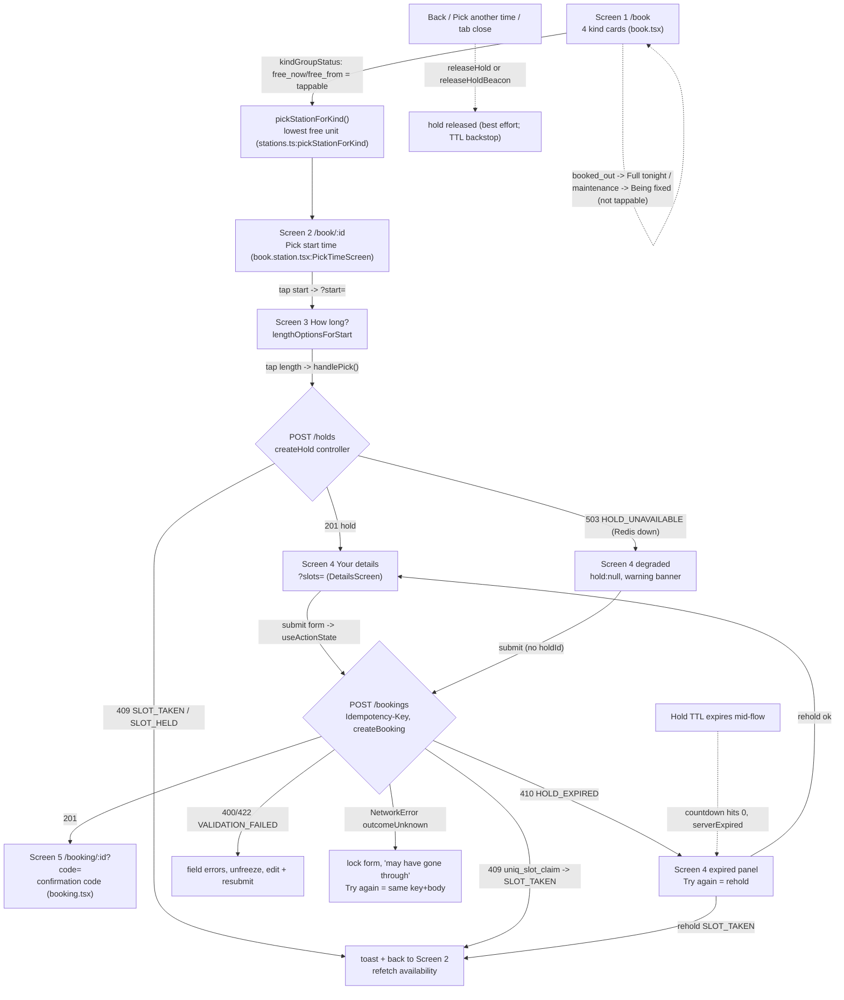

# Booking flow (web + API)

Current end-to-end path, screen 1 to confirmation code. Traced from code, not
the graph (graphify only indexes the stale `src/mockups/` copy, not the real
routes). Cite lines are current as of this doc.

## Flowchart

## Web <-> API map

| Web call (api.ts) | Method + path | Sends | Parses |
|---|---|---|---|
| `createHold` | POST `/holds` | stationId, startsAt, slotCount | holdId, expiresAt, ttlSeconds, quoteMinor |
| `releaseHold` / `releaseHoldBeacon` | POST `/holds/release` | holdId, stationId, startsAt, slotCount | 204 |
| `createBooking` | POST `/bookings` + `Idempotency-Key` | stationId, startsAt, slotCount, partySize:1, holdId?, player | booking + confirmationCode |
| `getBooking` | GET `/bookings/:id?code=` | code | booking |

Every request goes through `request()` (api.ts:87); non-2xx -> typed
`ApiRequestError`, no answer -> `NetworkError` with `outcomeUnknown`.

## Edge-case map

| Case | Handled at (file:line) | Behaviour | Gap / risk |
|---|---|---|---|
| Two users confirm same cell | booking/data.ts:56 `uniq_slot_claim` 11000 -> SLOT_TAKEN; index on `(venueId,cellStart,stationId)` | Loser gets 409, bounced to screen 2; Mongo txn is the only backstop | None. Redis hold is UX only (booking-correctness.md) |
| Hold expiry mid-flow | book.station.tsx:196 countdown + :514 confirm HOLD_EXPIRED -> serverExpired | 60/20/0s live announce; expired panel; Try again = rehold | Client clock drives countdown; server 410 is authority |
| Hold release on unmount / back | book.station.tsx:266 teardown (deferred, StrictMode-safe) + :247 pagehide beacon | In-app unmount releases reliably; tab close best-effort | Beacon can drop; TTL is real backstop |
| All units of a kind taken | stations.ts:213 kindGroupStatus -> booked_out; book.tsx:112 renders dashed non-button | Card "Full tonight", not tappable | Count only refreshes on availability refetch, not live |
| Kind with zero free units now but later | stations.ts:222 free_from earliest across units | Card "Free from 9:30 pm", tappable -> picks that unit | See aggregation gap below |
| Kind with zero units seeded | stations.ts:groupStationsByKind filter length>0 | Card omitted entirely | Never happens with seed |
| DST / midnight-crossing | stations.ts adjacency via endsAt==startsAt string compare; server grid | No `startsAt + n*grid` math; cells carry localLabel | None; DESIGN.md "Do NOT" honored |
| Idempotency-key replay | idempotency.ts:52 insertOne _id IS claim; :83 completed/failed -> replay | Same key+hash replays stored response; different hash -> 422 REUSED | Key frozen with body (book.station.tsx:483) |
| Invalid / rejected Zod input | hold+booking controllers safeParse -> VALIDATION_FAILED; client pre-parse book.station.tsx:477 | 400/422, field errors mapped by playerFieldErrors | None |
| API down / degraded Redis | hold controller:52 degraded -> 503 HOLD_UNAVAILABLE; confirm proceeds w/o hold | Screen 4 degraded banner; booking still allowed | Correctness intact; more post-confirm conflicts |
| Venue timezone | server localizes cells; web uses venue.timezone only for end label (stations.ts:instantLabel) | All display from server localLabel | None |
| Double-tap confirm | book.station.tsx:465 useActionState `confirming` disables submit; :639 disabled; frozen body :483 | Second tap blocked; same key+body if it slips through | Server REQUEST_IN_FLIGHT (idempotency.ts:98) 409 backstop |
| Double-tap length (screen 3) | book.station.tsx:718 pendingHours disables all length buttons (:207) | One hold per tap | None |

## Aggregation correctness gap (new 4-kind cards)

The 4-kind aggregation is correct on double-booking but introduces a UX
mismatch, not a data-correctness bug:

- **Point-in-time only.** `kindGroupStatus` "N free now" (stations.ts:200) and
  `pickStationForKind` (stations.ts:245) both read the same availability
  snapshot. The count is not live; it refreshes only when the availability
  query refetches or is invalidated.
- **Pick pins one unit, never re-aggregates.** Tapping a "3 free now" PS5 card
  commits to a single unit (lowest-numbered free, e.g. PS5 #4) via
  `navigate({ to:"/book/$stationId" })` (book.tsx:207). If that specific unit
  is taken by someone else between screen 1 and confirm, the flow bounces the
  user back (SLOT_TAKEN / SLOT_HELD) even though PS5 #5/#6 are still free. The
  card promised kind-level availability; the hand-off is station-level and does
  not fall back to a sibling unit.
- **Not a correctness gap.** Double-booking is still impossible: the hold check
  (hold controller:44) and `uniq_slot_claim` at confirm re-verify the exact
  unit server-side. The race only costs an avoidable bounce, never a bad
  booking.
- **Dead-tap guard.** `if (target) onPick(target)` (book.tsx:106) means a card
  that is bookable but whose pick returns undefined does nothing. Currently
  unreachable (bookable status implies a pickable unit), but it fails silently
  with no user feedback if that invariant ever breaks.

Upgrade path if the bounce matters: re-run `pickStationForKind` against fresh
availability on SLOT_TAKEN and retry a sibling unit before bouncing to screen 2.
